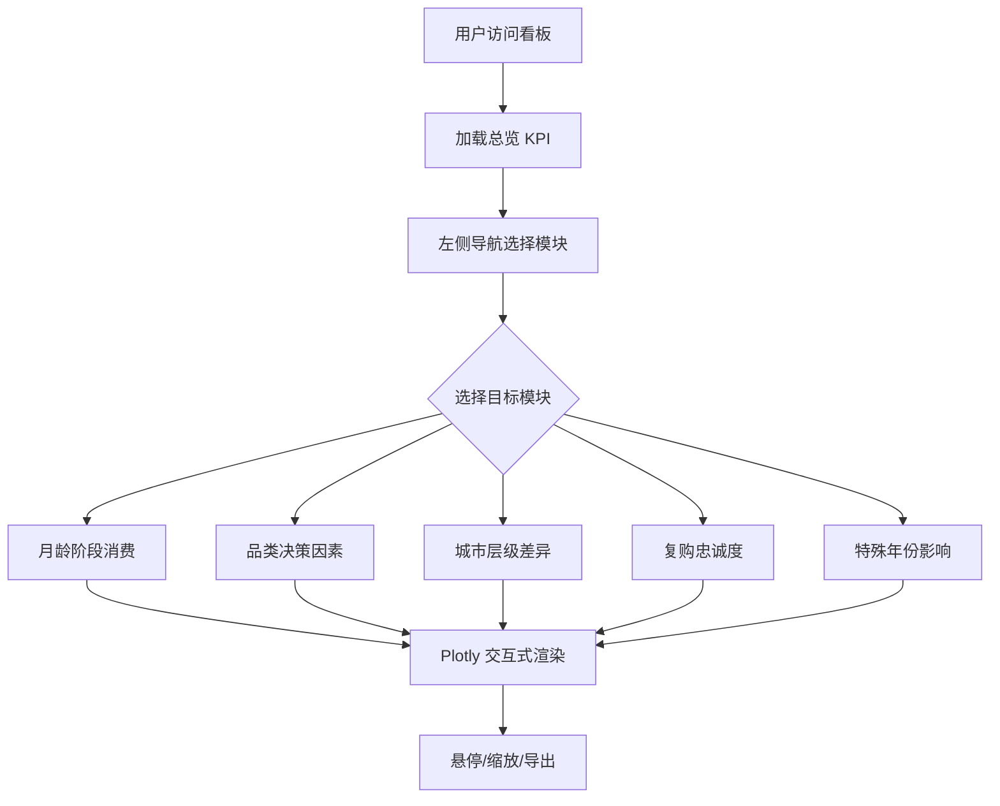

# 母婴市场消费分析看板 - 产品需求文档（PRD）

## 1. 产品概述

本项目是一个面向母婴行业分析师与品牌运营人员的全栈数据可视化看板，旨在通过多维度数据洞察揭示母婴市场消费规律。系统基于 Python 后端进行数据清洗、转换与聚合，前端采用 Vue3 + Vuetify 构建响应式界面，通过 Plotly.js 实现可缩放、可下钻、可导出的交互式图表。

- **目标用户**：母婴品牌运营人员、市场分析师、品类采购决策者
- **核心价值**：将分散的母婴消费数据聚合为可读、可下钻、可决策的洞察看板，辅助品类策略与营销决策

## 2. 核心功能

### 2.2 功能模块

看板采用单页多模块滚动布局，左侧为模块导航，主区域按业务模块分区呈现。共包含 6 个核心区域：

1. **总览看板**：关键指标卡片 + 出生率趋势总览
2. **月龄阶段消费分析模块**：6 个阶段 × 类目占比 + 客单价趋势
3. **品类购买决策因素分析模块**：5 大品类 Top3 决策因素
4. **城市层级消费差异分析模块**：一线 vs 下沉市场对比
5. **复购品牌忠诚度分析模块**：高频消耗品生存曲线
6. **特殊年份出生率影响分析模块**：疫情与龙宝宝年份影响

### 2.3 页面详情

| 区域名称 | 模块名称 | 功能描述 |
|-----------|-------------|---------------------|
| 总览看板 | 关键指标卡片 | 展示总消费额、用户数、平均客单价、复购率等 KPI |
| 总览看板 | 出生率趋势 | 全国出生率年度趋势折线，标注特殊年份 |
| 月龄阶段消费 | 类目消费占比 | 6 个阶段各呈现环形图，展示类目金额占比 |
| 月龄阶段消费 | 客单价趋势 | 折线图展示 6 阶段客单价变化趋势 |
| 品类决策因素 | Top3 决策因素 | 5 大品类雷达图/条形图，展示品牌/价格/安全性等 Top3 因素 |
| 城市层级差异 | 品类偏好对比 | 热力图对比一线与下沉市场品类偏好 |
| 城市层级差异 | 价格带分布 | 箱线图对比两市场各品类价格分布 |
| 复购忠诚度 | 品牌停留生存曲线 | 生存曲线展示纸尿裤/奶粉品牌平均停留时长 |
| 复购忠诚度 | 换品牌时间分布 | 时间序列展示换品牌时间分布特征 |
| 特殊年份影响 | 出生率波动 | 折线标注 2020-2022、2012、2024 特殊年份 |
| 特殊年份影响 | 市场规模影响 | 柱状图展示特殊年份对细分品类影响 |

## 3. 核心流程

用户打开看板后，左侧导航可在各模块间快速跳转；主区域自上而下依次呈现各分析模块。每个图表均支持 Plotly 交互（悬停查看数值、图例筛选、缩放、下载 PNG、切换图表类型）。

## 4. 用户界面设计

### 4.1 设计风格

- **主色调**：暖奶油底色（#FFF8F3）+ 柔和珊瑚橙（#FF8A65）作为强调色，搭配薄荷绿（#7CB342）与温润奶茶棕（#A1887F）作辅助
- **次色调**：粉尘玫瑰（#EC9BAE）、天空蓝（#64B5F6）用于图表区分
- **按钮风格**：圆角胶囊按钮，柔和阴影，主按钮珊瑚橙渐变
- **字体**：标题用「Noto Serif SC」衬线体体现温润感，正文用「Noto Sans SC」保证可读性，数字用「Sora」增强数据感
- **布局风格**：卡片式布局，圆角 16px，柔和投影，顶部固定导航栏 + 左侧模块锚点导航
- **图标风格**：圆润线性图标，配合柔和插画感

### 4.2 页面设计概览

| 区域名称 | 模块名称 | UI 元素 |
|-----------|-------------|-------------|
| 顶部导航 | 品牌标题 | 渐变 Logo 文案 + 全局时间范围筛选 + 主题切换 |
| 总览看板 | KPI 卡片 | 4 张指标卡，数字滚动动画，趋势箭头 |
| 月龄阶段消费 | 阶段标签页 | 6 个阶段标签页切换 + 环形图 + 折线图 |
| 品类决策因素 | 品类卡片网格 | 5 张品类卡片，每张含雷达图 |
| 城市层级差异 | 双列对比 | 热力图 + 箱线图并排 |
| 复购忠诚度 | 生存曲线区 | 渐变填充曲线 + 时间分布条形图 |
| 特殊年份影响 | 时间轴 | 标注年份的折线 + 影响柱状图 |

### 4.3 响应式

桌面优先设计（≥1280px 最佳），平板（768-1280px）自适应栅格，移动端（<768px）单列堆叠并隐藏侧边导航改为底部 Tab。

## 5. 数据来源

基于 Python 脚本生成的模拟 CSV 数据集，覆盖 2010-2024 年母婴消费记录，包含：消费明细表、用户画像表、品类决策因素表、品牌忠诚度表、出生率统计表。数据需符合母婴市场真实分布特征（如孕期囤货以营养品/待产包为主，0-3 月以奶粉/纸尿裤为主）。
