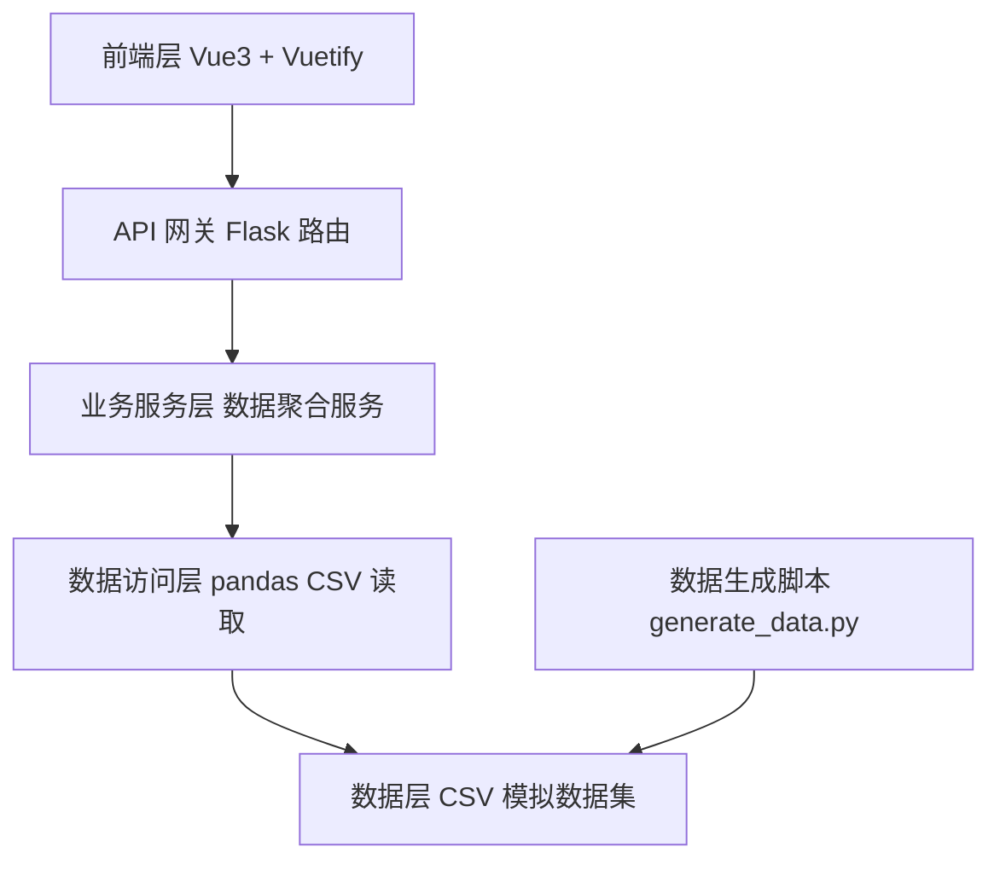
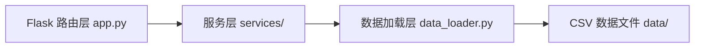
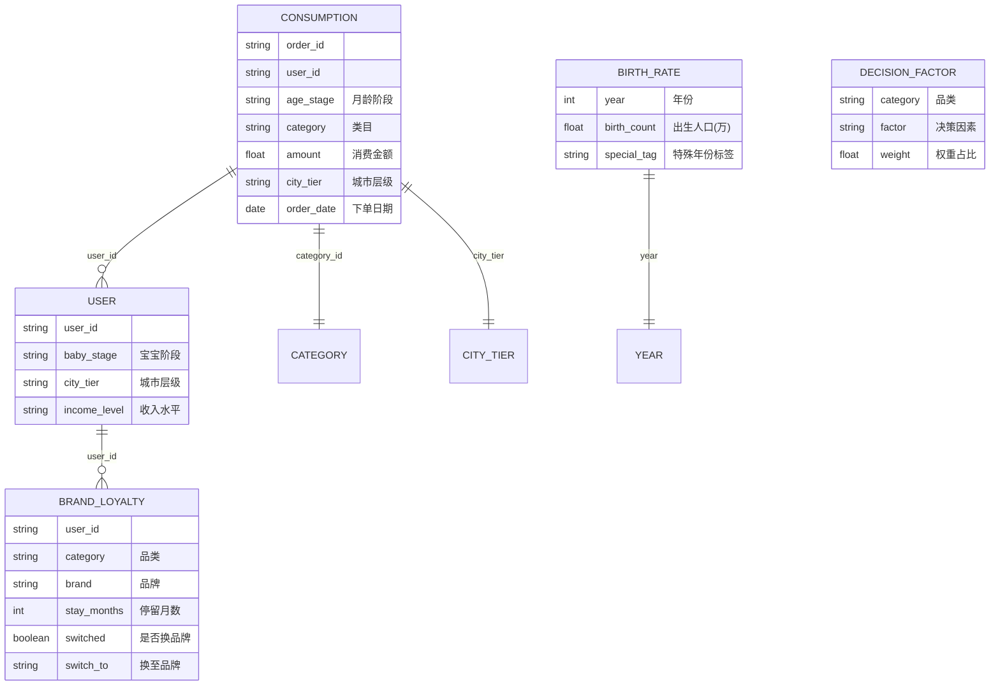

# 母婴市场消费分析看板 - 技术架构文档

## 1. 架构设计

本项目采用前后端分离架构。Python 后端负责数据生成、清洗与 API 服务，Vue3 前端负责界面渲染与 Plotly 可视化交互。



## 2. 技术说明

- **前端**：Vue@3 + Vuetify@3 + Plotly.js + Vue Router + Pinia
- **构建工具**：Vite
- **后端**：Flask@3 + pandas + flask-cors
- **数据源**：CSV 模拟数据文件（由 Python 脚本生成）
- **可视化**：Plotly.js（通过 plotly.js-dist-dist 引入），支持缩放、下钻、导出 PNG

## 3. 路由定义

| 路由 | 用途 |
|-------|---------|
| / | 看板主页面，按模块分区滚动 |

前端为单页应用，通过左侧锚点导航在各模块间滚动定位。

## 4. API 定义

### 4.1 总览接口
- `GET /api/overview` — 返回总览 KPI 与出生率趋势

### 4.2 月龄阶段接口
- `GET /api/age-stage/consumption` — 返回 6 阶段类目消费占比与客单价

### 4.3 品类决策因素接口
- `GET /api/category/decision-factors` — 返回 5 大品类 Top3 决策因素

### 4.4 城市层级接口
- `GET /api/city-tier/comparison` — 返回一线 vs 下沉市场品类偏好与价格带分布

### 4.5 复购忠诚度接口
- `GET /api/loyalty/survival` — 返回纸尿裤/奶粉品牌生存曲线与换品牌时间分布

### 4.6 特殊年份影响接口
- `GET /api/special-year/impact` — 返回特殊年份出生率波动与品类影响

### 4.7 响应统一格式
```json
{
  "code": 200,
  "message": "success",
  "data": { ... }
}
```

## 5. 服务端架构图



## 6. 数据模型

### 6.1 数据模型定义



### 6.2 数据文件定义

| CSV 文件 | 字段 | 用途 |
|----------|------|------|
| consumption.csv | order_id,user_id,age_stage,category,amount,city_tier,order_date | 消费明细 |
| brand_loyalty.csv | user_id,category,brand,stay_months,switched,switch_to_date | 品牌忠诚度 |
| birth_rate.csv | year,birth_count,special_tag | 出生率统计 |
| decision_factors.csv | category,factor,weight | 决策因素权重 |
| users.csv | user_id,age_stage,city_tier,income_level | 用户画像 |

## 7. 项目目录结构

```
label-101/
├── backend/
│   ├── app.py                  # Flask 主应用入口
│   ├── generate_data.py        # 模拟数据生成脚本
│   ├── data_loader.py           # CSV 数据加载与缓存
│   ├── services/                # 业务聚合服务
│   │   ├── overview_service.py
│   │   ├── age_stage_service.py
│   │   ├── category_service.py
│   │   ├── city_tier_service.py
│   │   ├── loyalty_service.py
│   │   └── special_year_service.py
│   ├── data/                    # CSV 数据文件
│   └── requirements.txt
├── frontend/
│   ├── src/
│   │   ├── App.vue
│   │   ├── main.js
│   │   ├── router/
│   │   ├── stores/
│   │   ├── api/                 # axios 请求封装
│   │   ├── components/
│   │   │   ├── charts/          # Plotly 图表组件
│   │   │   └── layout/          # 布局组件
│   │   └── views/
│   │       └── Dashboard.vue
│   ├── package.json
│   └── vite.config.js
└── README.md
```
